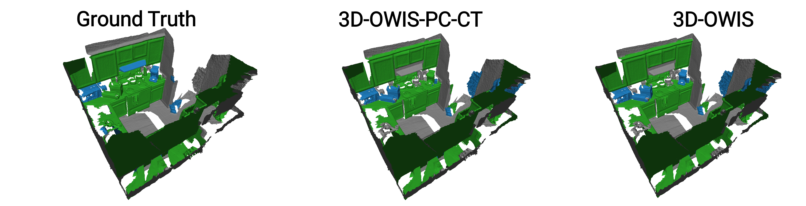
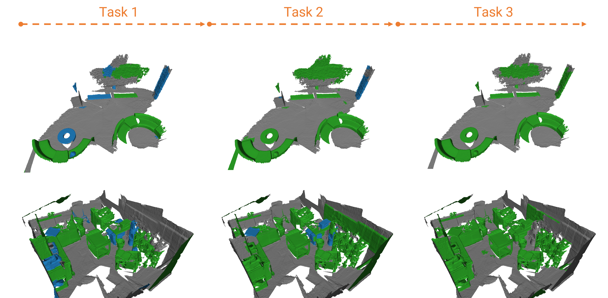

<div align="center">
 
## 3D-OWIS: 3D Indoor Instance Segmentation in an Open-World

</div>

<div align="center">
<a href="">Mohamed El Amine Boudjoghra</a><sup>1</sup>, <a href="">Salwa K. Al Khatib</a><sup>1</sup>, <a href=""> Jean Lahoud</a><sup>1</sup>, <a href="">Hisham Cholakkal</a><sup>1</sup>, <a href="">Rao Muhammad Anwer</a><sup>1,2</sup>,  <a href="">Salman Khan</a><sup>1,3</sup>, <a href="">Fahad Khan</a><sup>1,4</sup>

<sup>1</sup>Mohamed Bin Zayed University of Artificial Intelligence (MBZUAI) <sup>2</sup>Aalto University <sup>3</sup>Australian National University <sup>4</sup>Linköping University
</div>


<div align="center">
 
<a href='https://aminebdj.github.io/publications/3d_owis' target="_blank"></a> <a href='https://aminebdj.github.io/publications/3d_owis' target="_blank"></a>

 </div>


https://github.com/aminebdj/3D-OWIS/assets/95423980/aa937e74-9a90-4c09-8c65-bc11a5974dfd


<br>


### News

* **25 September 2023**: [3D-OWIS paper](https://arxiv.org/abs/2210.03105) released on arXiv. 📝
* **25 September 2023**: Code and splits released. 💻
* **22 September 2023**: Paper accepted into <b>NeurIPS2023</b>. 🥳


### Abstract

We formulate the problem of 3D point cloud instance segmentation in the open world, where we relax the assumption of a closed setting of classes during the training. We propose an auto-labeling scheme to produce pseudo-labels during training and induce separation to separate known and unknown category labels. We further improve the pseudo-labels quality at inference by adjusting the unknown class probability based on the objectness score distribution. We also introduce carefully curated open-world splits leveraging realistic scenarios based on inherent object distribution, region-based indoor scene exploration and randomness aspect of open-world classes. Extensive experiments reveal the efficacy of the proposed contributions leading to promising open-world 3D instance segmentation performance.


<div align="center">

**Figure I:** Proposed open-world 3D instance segmentation pipeline.

 </div>

## Qualitative results
<br></br>


<div align="center">
 
**Figure II:** The performance of 3D-OWIS in masking unknown instances is shown in the above figure. The known classes are assigned the green color, while the unknown and background objects are assigned blue and gray respectively.

</div>



<div align="center">
 
**Figure III:** 3D-OWIS is also capable of progressively learning novel classes, as shown in the following figure, once thier labels are introduced in the training process.

</div>


### Navigate in the scenes

 Kindly click on the icon to navigate in the scenes
 

 <div align="center">
 
|  | Scene 1 | Scene 2 | Scene 3 |
| -- | -- | -- | -- |
| 3D-OWIS | <a href="https://skfb.ly/oHVS7" target=”_blank”></a> | <a href="https://skfb.ly/oHXKJ" target=”_blank”></a> | <a href="https://skfb.ly/oHXKY" target=”_blank”></a> | 
| Ground truth | <a href="https://skfb.ly/oHXLY" target=”_blank”></a> | <a href="https://skfb.ly/oHXMq" target=”_blank”></a> | <a href="https://skfb.ly/oHXMu" target=”_blank”></a> |
| Input scene | <a href="https://skfb.ly/oHXMw" target=”_blank”></a> | <a href="https://skfb.ly/oHXMF" target=”_blank”></a> | <a href="https://skfb.ly/oHXML" target=”_blank”></a> |


</div>


### Comparative visualization

<div align="left">we show the progression of learning novel classes throughout the three tasks, and a comparison to the ground truth for our model with and without <b>PC</b>(Probability Correction) and <b>CT</b>(Confidence Threshold).
 
</div>

<br>

<div align="center">
    
     
</div>

## Installation guide

Kindly check [Installation guide](./Installation.md) on how to setup the Conda environment and how to preprocess ScanNet200 dataset.

## Use our splits with another 3D instance segmentation model

You can import the labels of the ```PREVIOUSLY_KNOWN```, ```CURRENTLY_KNOWN```, and ```UNKNOWN``` classes from ```./datasets/scannet200/owis_splits.py``` for usage with another codebase.

**Example**: the following code will load the previously known, currently known, and unknown classes for split A task1

```
from datasets.scannet200.owis_splits import PREV_KNOWN_CLASSES_LABELS, KNOWN_CLASSES_LABELS, UNKNOWN_CLASSES_LABELS

OW_task = 'task1'
split = 'A'

PREVIOUSLY_KNOWN = PREV_KNOWN_CLASSES_LABELS[split][OW_task]
CURRENTLY_KNOWN = KNOWN_CLASSES_LABELS[split][OW_task]
UNKNOWN = UNKNOWN_CLASSES_LABELS[split][OW_task]
```


## Training and testing :train2:
For training a model ```<MODEL>``` with a split ```<SPLIT>``` please run the following command:

**NB**: ```<SPLIT>``` takes the values **'A'**, **'B'**, or **'C'**. 

We provide the scripts for reproducing the results for the three models **3d_owis**, **3d_owis-pc-ct**, and **oracle**.

```bash
sh scripts/train_<MODEL>/<SPLIT>/train.sh
```
For testing a task ```<TASK>``` for a specific split ```<SPLIT>``` please run the following command:

**NB**: ```<TASK>``` takes the values **'task1'**, **'task2'**, or **'task3'**

**Important for inference**: please make sure to not forget to specify the ```<EXPERIMENT_NAME>```, ```<SPLIT>```, and  ```<TASK>``` when running the inference, as the prototypes are loaded from the path ```saved/<EXPERIMENT_NAME>/<SPLIT>/<TASK>/``` to perform the probability correction.

```bash
python main_instance_segmentation.py \
general.checkpoint='saved/<EXPERIMENT_NAME>/<SPLIT>/<TASK>/CHECKPOINT_NAME.ckpt' \
general.experiment_name=<EXPERIMENT_NAME> \
general.split=<SPLIT> \
general.OW_task=<TASK> \
general.margin=<CLUSTERING_MARGIN_USED_DURING_TRAINING> \
general.correct_unknown_cls_prob=True \
general.train_mode=false
```


## Trained checkpoints and output predictions
<div align="center">
 
|  | Checkpoints | Clustering Margin |
| -- | -- | -- |
| 3D-OWIS | <a href="https://mbzuaiac-my.sharepoint.com/:f:/g/personal/mohamed_boudjoghra_mbzuai_ac_ae/Ejs0-mngp25PqWlj11WaVMMB8WCEhR4SgGE2x6qhCqegyQ?e=lWshqf" target=”_blank”><div align="center"></div></a> | <b>A</b> :1.0, <b>B</b> :3.0, <b>C</b> :1.0 | 
| 3D-OWIS - PC - CT | <a href="https://mbzuaiac-my.sharepoint.com/:f:/g/personal/mohamed_boudjoghra_mbzuai_ac_ae/ElZHEIVkVNBImxd7sF5j3jwBM0cWM4S277y_e-3VDtaT1g?e=4f2XTQ" target=”_blank”><div align="center"></div></a> | <b>A</b> :1.0, <b>B</b> :3.0, <b>C</b> :1.0 |
| Oracle | <a href="https://mbzuaiac-my.sharepoint.com/:f:/g/personal/mohamed_boudjoghra_mbzuai_ac_ae/EqVdcm7q3bVInLxVcATPI18BTTzuHyCkrSB3y3mF4m5ftA?e=8h6csP" target=”_blank”><div align="center"></div></a> | <b>A</b> :1.0, <b>B</b> :3.0, <b>C</b> :1.0 |


</div>

## BibTeX :pray:
```

```
